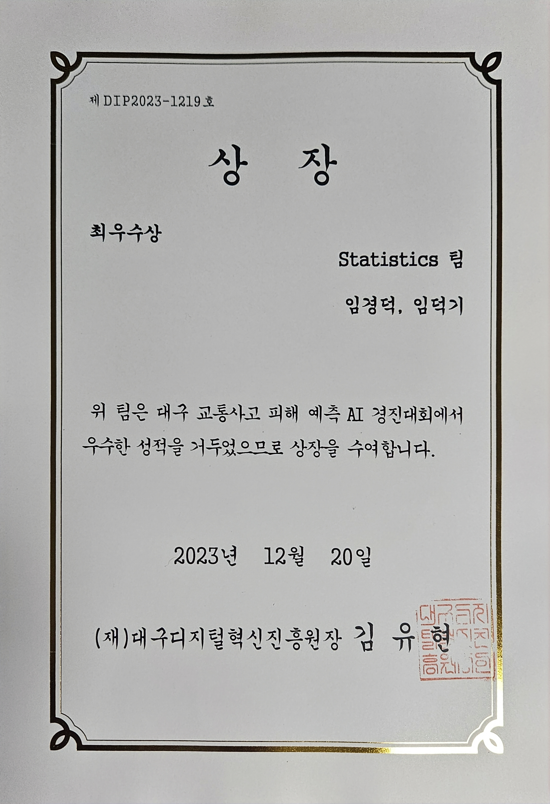

### 데이터 분석가 및 웹 개발자 임덕기입니다. 취미로 밴드를 하고 있습니다~ (베이스)

#### 풀스택 지향이며 AI 대회와 웹 개발 교육을 병행중입니다.

#### 데이콘 프로필: https://dacon.io/myprofile/482247/home

#### 캐글 프로필: https://www.kaggle.com/dukgiim

## 교육

- 23.07.05 ~ 현재: 삼성 청년 SW 아카데미 (SSAFY) 10기
- 23.04.05 ~ 23.07.04: 인공지능 부트캠프 이어드림스쿨 3기

## 기술 스택

## 수상 내역

- 23.11.15 - 23.12.11 DACON 대구 교통사고 피해 예측 AI 경진대회 최우수상 (2위) 수상

  

- 23.12.15 SQLD 취득

- 23.10.07 - 24.01.04 kaggle UBC Ovarian Cancer Subtype Classification and Outlier Detection (UBC-OCEAN) Bronze medal 취득 (92위/1326)

## 프로젝트

### 23.11.16 - 23.11.23 SSAFY 관통 프로젝트 - 금융 추천 사이트 프로젝트

- 역할

  - 회원가입, 로그인 백엔드 및 프론트엔드
  - 카카오맵 api 지도 검색
  - 금융상품 추천 (k-means clustering)

- 24.01.08 - 24.02.16 SSAFY 공통 프로젝트 - 카카오맵 API 기반 산책 커뮤니티 서비스 'walkytalky' 프론트엔드 개발
<!--
**DKIMDK/DKIMDK** is a ✨ _special_ ✨ repository because its `README.md` (this file) appears on your GitHub profile.

Here are some ideas to get you started:

- 👯 I’m looking to collaborate on ...
- 🤔 I’m looking for help with ...
- 💬 Ask me about ...
- 📫 How to reach me: ...
- 😄 Pronouns: ...
- ⚡ Fun fact: ...
  -->
